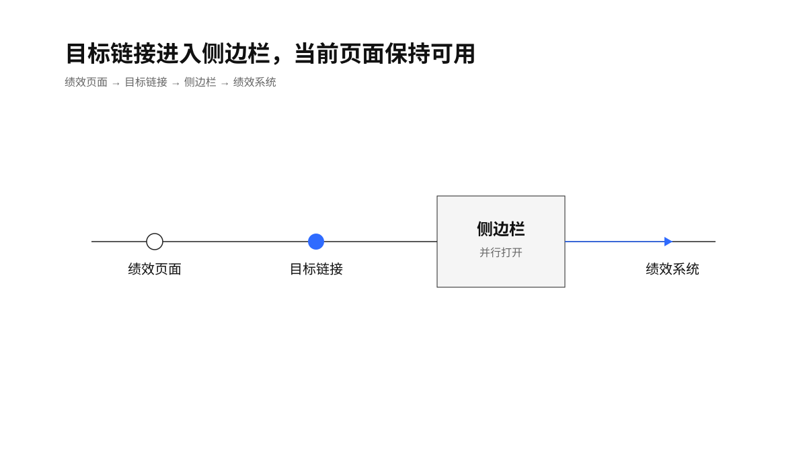
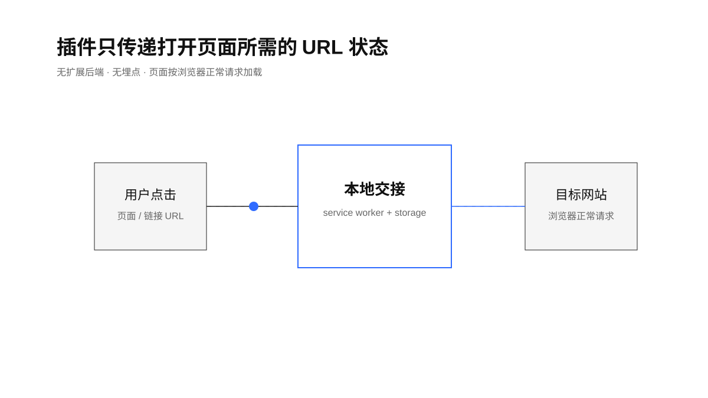
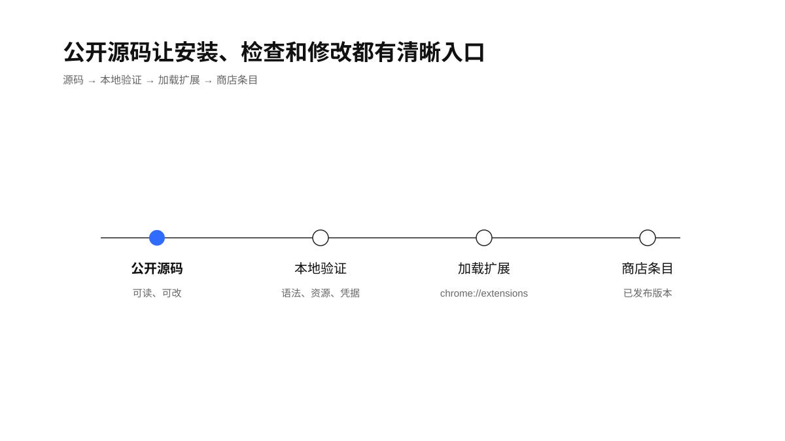

> “Given enough eyeballs, all bugs are shallow.” — Eric S. Raymond, [The Cathedral and the Bazaar](https://www.catb.org/~esr/writings/cathedral-bazaar/cathedral-bazaar/)

# 飞书绩效助手

把飞书 / Lark 绩效页面中的 Base、Wiki 和 App 链接放进 Chrome 侧边栏，减少来回切换窗口的动作。Chrome 商店中的已发布条目仍叫“绩效助手”。

已发布的 Chrome Web Store 条目：[绩效助手](https://chromewebstore.google.com/detail/gadlmgoojihfbclnnhkkllmjdmgpdjjl?utm_source=item-share-cb)

## 它做什么

插件只在匹配的飞书 / Lark 页面上工作：点击绩效页面里的目标链接时，链接会在侧边栏打开；点击插件图标或右键菜单时，当前页面也可以移到侧边栏，同时把当前标签页带到绩效系统。

<p align="center">
  
</p>

仓库代码对应商店中的 Manifest V3 版本 3.3。插件没有扩展自己的后端、埋点或广告网络；URL 交接状态保存在本地浏览器中。完整边界见 [PRIVACY.md](PRIVACY.md)。

<p align="center">
  
</p>

## 快速开始

1. 下载或克隆本仓库。
2. 打开 `service-worker.js`，把 `DEFAULT_PERF_URL` 改成你所在租户的绩效系统地址，例如 `https://your-tenant.feishu.cn/perf/review`。
3. 打开 Chrome 的 `chrome://extensions`，开启“开发者模式”。
4. 点击“加载已解压的扩展程序”，选择本仓库目录。

插件依赖 Chrome 的 Side Panel 能力；首次使用时，如果侧边栏没有出现，可点击工具栏中的扩展图标或使用页面右键菜单。

## 代码结构

```text
manifest.json       Manifest V3、权限和匹配域名
content.js          识别绩效页中的目标链接
service-worker.js   打开侧边栏、处理菜单和标签页导航
panel.html/js       侧边栏界面与本地 URL 交接
scripts/validate.sh 本地语法、资源和敏感信息检查
```

<p align="center">
  
</p>

## 边界

- 这是一个浏览器侧工具，不提供绩效数据分析或权限绕过能力。
- 用户仍需拥有目标飞书 / Lark 页面访问权限。
- 页面内容由目标网站自身加载；插件不会把绩效文本上传到扩展作者控制的服务。
- 商店发布包与本仓库的后续提交可能出现版本差异，发布状态以 Chrome Web Store 条目为准。

## 验证

```bash
bash scripts/validate.sh
```

本地验证会检查 Manifest V3、脚本语法、资源存在性，并扫描常见凭据格式。它不等同于 Chrome Web Store 审核通过。

## 开源许可

本项目采用 [MIT License](LICENSE)。欢迎提交问题和小范围、可复核的改动；贡献要求见 [CONTRIBUTING.md](CONTRIBUTING.md)。
