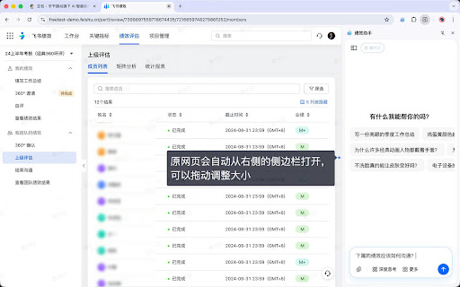
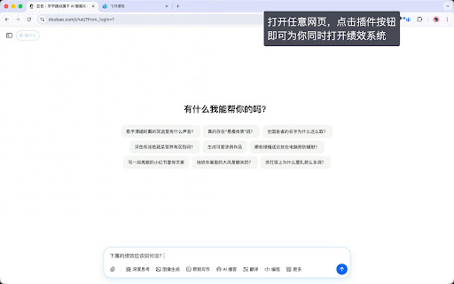
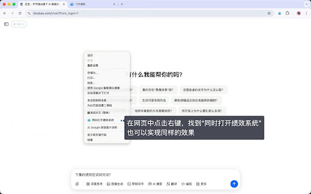
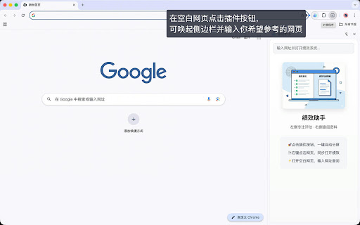
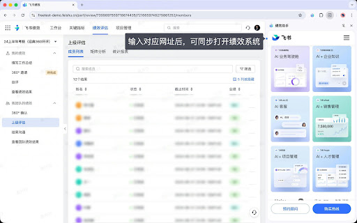

> “Given enough eyeballs, all bugs are shallow.” — Eric S. Raymond, [The Cathedral and the Bazaar](https://www.catb.org/~esr/writings/cathedral-bazaar/cathedral-bazaar/)

# 飞书绩效助手

把“左侧打分、右侧参考”变成一个可执行的 Chrome 侧边栏工作台。

绩效评估时，管理者往往需要在绩效系统和员工的文档、周报、数据、历史结果之间来回切换。飞书绩效助手把参考页面放进浏览器侧边栏，让打分页面和证据材料保持在同一个窗口里，减少切换带来的思路中断与信息遗漏。

| 安装已发布版本 | 查看源代码 |
| --- | --- |
| [Chrome Web Store：绩效助手](https://chromewebstore.google.com/detail/gadlmgoojihfbclnnhkkllmjdmgpdjjl?utm_source=item-share-cb) | [TongyiDai/feishu-performance-assistant](https://github.com/TongyiDai/feishu-performance-assistant) |

## 先看它怎样工作

打开绩效页面后，主窗口保留绩效系统，侧边栏承载当前要参考的页面。侧边栏里的页面由飞书 / Lark 自己加载，插件负责页面交接和布局。

<p align="center">
  
</p>

这个设计适合需要边看材料边判断的工作：左侧写评语、做评级，右侧查看项目产出；左侧整理总结，右侧核对过往绩效；左侧进行复核，右侧打开 AI 工具或 AI 生成的绩效总结。

## 三种进入方式

### 1. 点击插件图标：一键进入绩效工作台

在任意普通网页点击插件图标，当前页面会进入侧边栏，主标签页同时跳转到绩效系统。这样可以从正在阅读的材料直接开始评估。

<p align="center">
  
</p>

绩效系统地址由 `service-worker.js` 中的 `DEFAULT_PERF_URL` 配置。若当前页面属于支持的飞书 / Lark 域名，插件会优先按当前站点的 `/perf/review` 路径推导地址。

### 2. 右键菜单：把当前网页或链接送进侧边栏

浏览周报、文档或 AI 总结页面时，右键选择“同时打开绩效系统”。当前网页，或你右键点击的链接，会进入侧边栏；主标签页跳转到绩效系统。

<p align="center">
  
</p>

这个入口适合从一份具体材料开始工作，不需要先打开插件再复制网址。

### 3. 绩效页面内点击链接：自动拦截并并排打开

在绩效页面中点击指向飞书 Base、Wiki 或 App 的链接时，插件会识别目标地址，把它交给侧边栏打开。主页面继续保留在绩效系统中。

<p align="center">
  
</p>

自动拦截只在绩效路径下启用，普通飞书页面不会被接管。侧边栏加载任务时会自动收起输入框，为参考内容留出更多空间；手动打开侧边栏时，也可以直接输入网址访问。

## 适合哪些绩效场景

- **绩效打分**：左侧填写员工评语和评级，右侧查看全年项目产出、周报或文档。
- **过往绩效参考**：左侧整理本期总结，右侧核对员工过去的绩效结果。
- **AI 问答**：右侧打开 AI 工具，在评估过程中查询、追问和补充判断依据。
- **AI 总结对照**：右侧挂载 AI 生成的绩效总结，左侧对照原始材料进行复核与评级。

下面的商店截图展示了 AI 总结对照的使用形态：侧边栏保留参考卡片，主窗口继续进行绩效操作。

<p align="center">
  
</p>

## 从源码运行

### 1. 配置绩效系统地址

编辑 `service-worker.js`：

```js
const DEFAULT_PERF_URL = "https://your-tenant.feishu.cn/perf/review";
```

将示例地址换成你所在租户实际可访问的绩效页面。源码仓库保留占位地址，避免把任何组织的真实入口写进公共代码。

### 2. 以开发者模式加载

1. 克隆或下载本仓库。
2. 打开 Chrome 的 `chrome://extensions`。
3. 开启“开发者模式”，点击“加载已解压的扩展程序”。
4. 选择仓库目录。
5. 打开飞书 / Lark 绩效页面，使用插件图标、右键菜单或页面内链接开始工作。

插件使用 Chrome Manifest V3 和 Side Panel 能力。支持的站点域名包括：

- `feishu.cn`
- `larkoffice.com`
- `larksuite.com`
- `feishuapp.com`

## 代码如何分工

```text
manifest.json       Manifest V3、权限、侧边栏和匹配域名
content.js          仅在绩效页面识别 Base / Wiki / App 链接
service-worker.js   处理插件图标、右键菜单、侧边栏和标签页跳转
panel.html/js       侧边栏界面、网址输入和页面加载
assets/store/       从 Chrome Web Store 条目取得的功能截图
assets/boards/      代码流程、隐私边界和发布路径图示
scripts/validate.sh 本地语法、资源和敏感信息检查
```

## 隐私与使用边界

插件只在用户主动点击插件图标、使用右键菜单，或在绩效页面点击目标链接时工作。它在本地浏览器中暂存侧边栏交接所需的 URL 和显示状态，不采集绩效文本、员工档案、评分、Cookie、密码或分析标识，也没有插件自有后端、广告网络或埋点服务。

页面内容仍由目标飞书 / Lark 网站按正常浏览器请求加载。用户需要拥有相应页面的访问权限；插件不提供数据分析、权限绕过或跨租户访问能力。完整说明见 [PRIVACY.md](PRIVACY.md)。

<p align="center">
  
</p>

## 版本与商店条目

当前源码对应 Chrome Web Store 中的 Manifest V3 `3.3` 版本。商店条目名称仍为“绩效助手”，开源项目名称采用“飞书绩效助手”。安装和发布状态以 [Chrome Web Store 条目](https://chromewebstore.google.com/detail/gadlmgoojihfbclnnhkkllmjdmgpdjjl?utm_source=item-share-cb)为准；源码后续提交可能与商店安装包产生差异。

商店文字介绍和截图的来源记录见 [`assets/store/SOURCES.md`](assets/store/SOURCES.md)。

## 本地验证

```bash
bash scripts/validate.sh
```

验证脚本会检查 Manifest V3、脚本语法、资源存在性和常见凭据格式。它用于检查源码完整性，不代表 Chrome Web Store 审核结果。

## 开源许可

本项目采用 [MIT License](LICENSE)。欢迎提交 Issue，或提出范围清晰、便于复核的改动。
